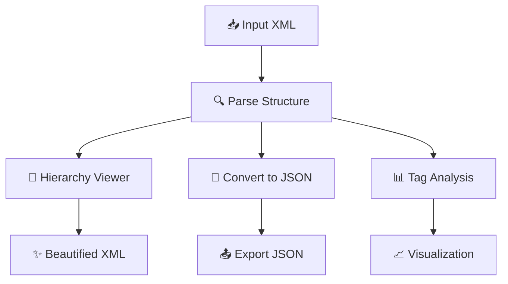

# 🚀 XML Data Extractor & Visualizer

### Transform Complex XML into Structured, Actionable Insights

> **From unreadable XML chaos → clean, visual intelligence in seconds.**

A modern, end-to-end XML processing application built with **Python + Gradio**, designed to simplify deeply nested XML into structured formats, analytics, and interactive visualizations.

---
## 🖼️ Images


---

## ✨ Product Overview

XML is powerful — but messy.

This tool eliminates complexity by providing a **single interface to parse, analyze, and visualize XML data**, making it useful for developers, analysts, QA engineers, and data professionals.

---

## 🧠 Why This Project Stands Out

Instead of just parsing XML, this system delivers **full data understanding**:

📂 Structural exploration
🔄 Smart XML → JSON transformation
📊 Automated analytics
📈 Interactive visual insights
✨ Clean and readable formatting

➡️ It’s not just a parser — it’s a **data interpretation engine**.

---

## 🚀 Key Features

✅ **Hierarchical XML Explorer** — Navigate deeply nested structures easily
✅ **XML to JSON Conversion** — Clean, structured output for downstream use
✅ **Tag Frequency Analysis** — Identify dominant patterns in data
✅ **Interactive Visualizations** — Powered by Plotly
✅ **XML Beautifier** — Instantly format messy XML
✅ **Web-Based UI** — Accessible via browser using Gradio
✅ **Colab Ready** — Zero setup deployment

---

## 🖥️ System Workflow



---

## 🛠️ Tech Stack

| Layer           | Technology                |
| --------------- | ------------------------- |
| Core Engine     | Python 3.8+               |
| Parsing         | xmltodict, BeautifulSoup4 |
| Data Processing | Pandas                    |
| Visualization   | Plotly                    |
| Frontend        | Gradio                    |

---

## ⚙️ Installation & Setup

### 🔹 Local Deployment

```bash
git clone https://github.com/Tanmay112004/xml-data-extractor.git
cd xml-data-extractor
pip install -r requirements.txt
python xml_data_extractor.py
```

---

### ☁️ Google Colab (Quick Demo)

```python
!pip install gradio xmltodict beautifulsoup4 plotly pandas
```

Run the script → get a **public Gradio link instantly**.

---

## 🎯 Use Cases

This tool is practical across multiple domains:

📡 API response debugging
📄 Config file validation
📊 Data preprocessing for analytics
🧪 QA structure verification
🎓 Academic data parsing
📦 XML → CSV/JSON transformation pipelines

---

## 📊 What Recruiters Will Notice

This project demonstrates:

🔥 Data parsing & transformation skills
🔥 Real-world problem solving (messy data handling)
🔥 Interactive data visualization
🔥 End-to-end application development
🔥 Deployment-ready UI (Gradio)

➡️ Strong signal for **Data Analyst / Data Scientist / Backend roles**

---

## 🔮 Future Enhancements

Planned improvements:

🔹 XML → CSV export pipeline
🔹 Schema validation (XSD support)
🔹 Large file optimization
🔹 Drag-and-drop UI improvements
🔹 API endpoint for automation
🔹 Cloud deployment (Docker + Streamlit/Gradio hosting)

---

## 🤝 Contributing

Contributions are welcome. Areas to explore:

✔ Performance optimization
✔ Advanced XML schema support
✔ UI/UX improvements
✔ Additional export formats

---

## 📜 License

MIT License — free for personal and commercial use.

---

## 👨‍💻 Author

**Tanmay Kshirsagar**

💻 GitHub: [https://github.com/Tanmay1112004](https://github.com/Tanmay1112004)
💼 LinkedIn: [https://linkedin.com/in/tanmay-kshirsagar](https://linkedin.com/in/tanmay-kshirsagar)

---

## ⭐ Support

If this project helped you:

➡️ Star ⭐ the repository
➡️ Share feedback
➡️ Suggest improvements

---

## 💬 Final Thought

> “Messy data kills productivity. Clean pipelines create impact.”

---
